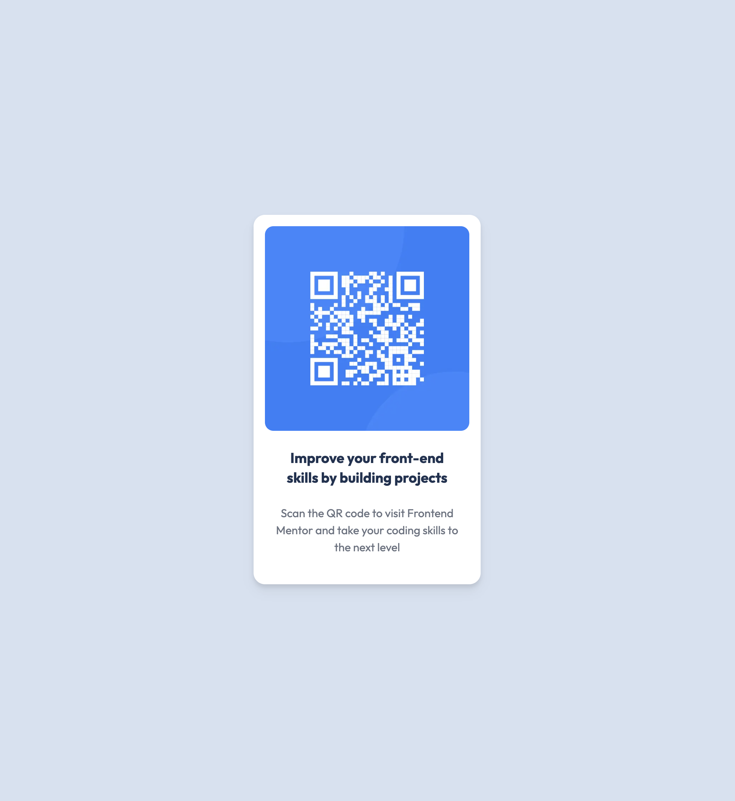

<h2 align="center"> ━━━━━━  ❖  ━━━━━━ </h2>

<!-- BADGES -->

   

   

   

   

   
    

---

## ❖ Information

I recreated <a href="https://github.com/jgengo-alt/qr-code-component">qr-code-component</a> with <a href="https://nextjs.org/https://nextjs.org/">NextJS</a> and continuous deployment using Github actions

---

## ❖ Challenges

Just forcing myself on developing with NextJS.

---

